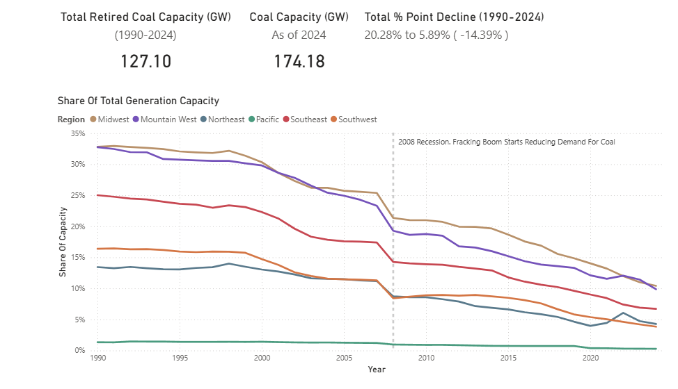
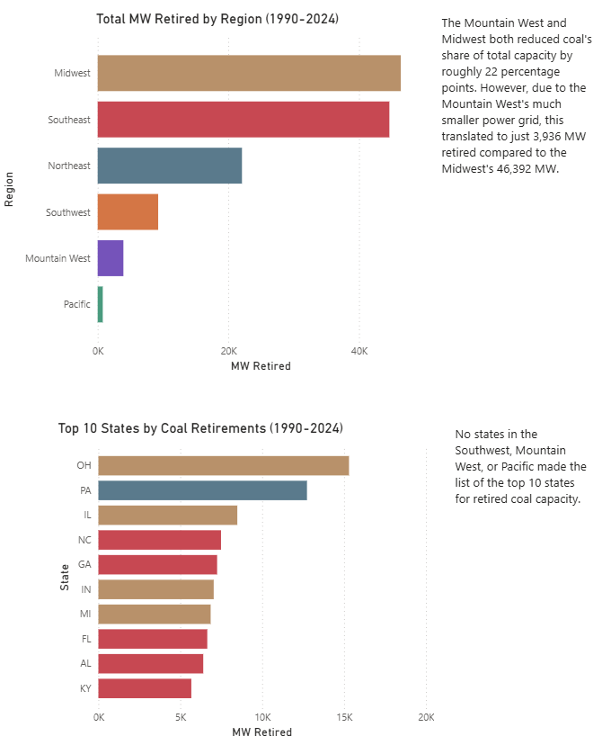
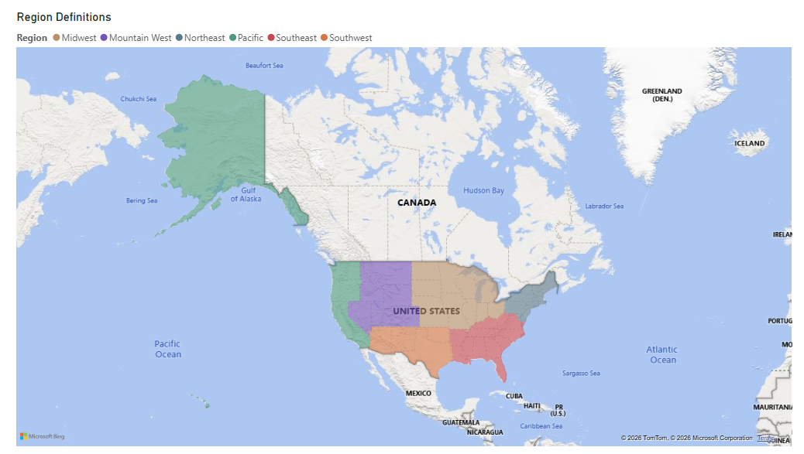

# U.S. Coal Transition Analysis (1990-2024)

A data analysis project examining the decline of coal-fired electricity generation across U.S. regions from 1990 to 2024, using EIA data and Power BI visualization

## Key Findings

- 127 GW of coal capacity retired nationally between 1990 and 2024, reducing coal's share of total national generation from 20.28% to 5.89%

- Regional concentration: Six of the top 10 states for coal retirements were in the Midwest (OH, IL, IN, MI) and Appalachia (PA, KY). These regions are historically dependent on coal for both generation and mining

- Percentage vs. MW retired: The Mountain West and Midwest both reduced coal's share of total capacity by roughly 22 percentage points. However, due to the Mountain West's much smaller power grid, this translated to just 3,936 MW retired compared to the Midwest's 46,392 MW

- Acceleration after 2008: The fracking boom and an increase in natural gas power plants dramatically reduced demand for coal, triggering steep declines across all regions through the 2010s

- Lower Southwest/Pacific representation: No states from the Southwest, Mountain West, or Pacific regions made the top 10 for absolute coal retirements, highlighting the geographic concentration of the transition

## Dashboard

### Regional Trends (1990-2024)



### Regional & State Retirements



### Region Defintions



## Data & Methods

- **Source:** U.S. Energy Information Administration (EIA) API
- **ETL Pipeline:** Python script extracts, processes, and stores data in SQLite. The `coal_generation_capacities.csv` file is exported from the processed data
- **Visualization:** Power BI with custom DAX measures
- **Time Period:** 1990-2024 annual data

---

## Setup & Usage

Analysis was performed using the `coal_generation_capacities.csv` file. This file is created automatically by running `run.py`

### Fetch EIA Data, Create The DB, & Export Coal Data to CSV

Register for a free EIA API key at eia.gov/opendata, then create a .env file at python/.env:

```text
EIA_API_KEY="your_key_here"
```

```bash
cd python

python -m venv venv
source venv/bin/activate      # Windows: venv\Scripts\activate
pip install -r requirements.txt

python run.py
```

### Project Structure

```text
coal-analysis-powerbi/
├── python/
│   ├── run.py    # Main process
│   ├── .env
│   ├── requirements.txt
│   ├── scripts/
│   │   └── export_for_powerbi.py
│   ├── utils/
│   │   ├── logger.py
│   │   ├── file_utils.py
│   │   ├── year_validator.py
│   │   └── validator.py
│   └── db/
│       ├── connection.py
│       └── generation_capacities.py
│
├── data/
│   ├── raw/         # Unprocessed JSON file
│   ├── processed/   # Exported CSV data
│   └── eia.db       # SQLite database
│
├── coal_analysis.pbix   # Power BI dashboard
└── README.md
```
